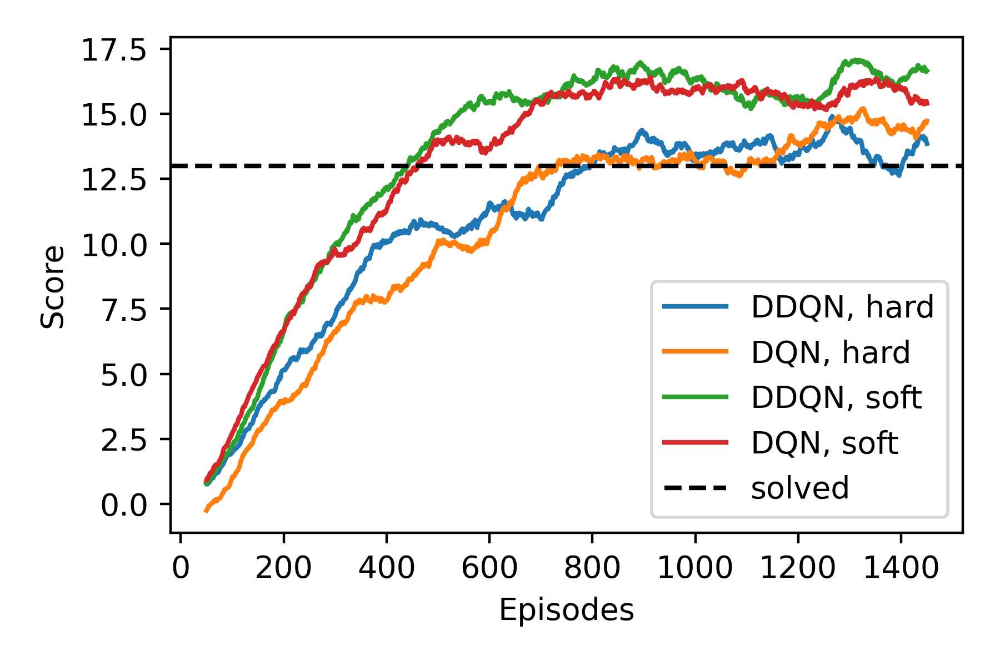

# Udacity DRLND
## P1 Navigation

## Project Details

Read about the environment [here](https://github.com/udacity/deep-reinforcement-learning/tree/master/p1_navigation).

Agents explore a large, square, bounded environment filled with blue and yellow bananas. Agent's receive a reward of +1 for collecting yellow bananas, and a reward of -1 for collecting blue bananas.

The environment is considered to have been resolved when the agent collects an average reward of +13 over 100 episodes.


## Getting Started

The `setup_env.sh` script can be used to create and configure an environment with all the required dependencies to run the included code. The script assumes `conda` is available.

In addition, a number of pre-built _Unity_ environments are required. They can be
obtained by running the included script `./get_unity_envs.sh`. Alternatively, 
they can be manually downloaded from:

1) https://s3-us-west-1.amazonaws.com/udacity-drlnd/P1/Banana/Banana_Linux.zip
2) https://s3-us-west-1.amazonaws.com/udacity-drlnd/P1/Banana/Banana_Linux_NoVis.zip
3) https://s3-us-west-1.amazonaws.com/udacity-drlnd/P1/Banana/VisualBanana_Linux.zip

The above environments should be downloaded to a "unity_environments" directory,
where they should be unzipped

## Instructions

The `navigation.py` file exposes a CLI built with `click`. There are three commands available:

```
python ./navigation.py --help
Usage: navigation.py [OPTIONS] COMMAND [ARGS]...

Options:
  --help  Show this message and exit.

Commands:
  plot-results
  run
  train
  ```
  
1) For training an agent:
    * `python ./navigation.py train`
2) For running a trained agent:
    * `python ./navigation.py run` 
3) For plotting saved results:
    * `python ./navigation.py plot-results`

Train an agent using the following command:

```
python ./navigation.py train --help
Usage: navigation.py train [OPTIONS]

Options:
  --learning-strategy [DQN|DDQN]  Train the agent using DQN or DDQN.
  --update-type [soft|hard]       Use soft updates or hard updates for
                                  'fixed-Q' TD targets.

  --n-episodes INTEGER            Number of episodes after which training will
                                  terminate.

  --headless                      Train the agent using the headless
                                  environment.

  --keep-training                 Continue training the agent up to n-episodes
                                  after the solved condition is met.

  --checkpoint TEXT               Path to a previously trained Agent's PyTorch
                                  checkpoint, if specified the Agents network
                                  will be initialised using the weights
                                  therein.

  --help                          Show this message and exit.
```

See a trained agent navigate the environment by running the following command. With no options specified the agent will be initialised using the `solved_weights.pth` included in the `./checkpoints` directory.

```
python ./navigation.py run --help
Usage: navigation.py run [OPTIONS]

Options:
  --checkpoint-path TEXT  Path to a checkpoints file with which to obtain
                          learned DQN weights.

  --help                  Show this message and exit.
```

## Results

For a more thorough investigation and presentation of results, and discussion of training strategies, see [Report.md](Report.md).

The image below shows a comparison of the scores (averaged over 100 episodes) of agents trained with a number of different strategies.



The video below shows a trained agent navigating the environment. The scores obtained by this agent in training are show by the green curve in the image above.

