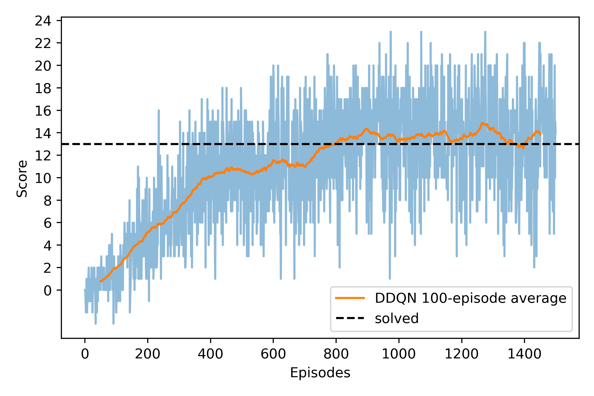

# Udacity DRLND
## P1 Navigation

## Project Details

Read about the environment [here](https://github.com/udacity/deep-reinforcement-learning/tree/master/p1_navigation).

Agents explore a large, square, bounded environment filled with blue and yellow bananas. Agent's receive a reward of +1 for collecting yellow bananas, and a reward of -1 for collecting blue bananas.

The environment is considered to have been resolved when the agent collects an average reward of +13 over 100 episodes.

## Getting Started

The `setup_env.sh` script can be used to create and configure an environment with all the required dependencies to run the included code. The script assumes `conda` is available.

## Instructions

Train the agent by running the following command.

`python ./navigation.py train`

`--learning-strategy (DQN|DDQN)` 

`--n-episodes`

`--headless`

`--keep-training`

`--checkpoint`

See a trained agent navigate the environment by running the following command.

`python ./navigation.py run`

`--learning-strategy (DQN|DDQN)` 

## Results

