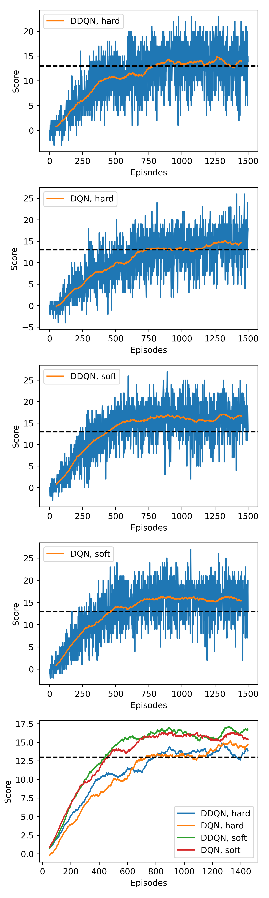

# Udacity DRLND
## P1 Navigation

### Environment

Agents explore a large, square, bounded environment filled with blue and yellow bananas. Agent's receive a reward of +1 for collecting yellow bananas, and a reward of -1 for collecting blue bananas.

The environment is considered to have been resolved when the agent collects an average reward of +13 over 100 episodes.

The representation of the state of the environment, depends on the environment used. For the `Banana_Linux` environment, the state is represented by a 32-dimensional vector whose components represent the Agent's position, velocity, and ray-based perception of its view of the environment. For the `VisualBanana_Linux` environment, the components of the state vector obtained from ray-based perception are instead replaced by raw pixel data obtained from the Agent's perspective. 

The results presented below are obtained for an agent in the `Banana_Linux` ray-based perception environment, where the state is represented by a vector with dimension 32.

The agent has four possible actions that it is able to take:
1) Move forwards.
2) Move backwards.
3) Turn left.
4) Turn right.

The above state representation, and choice of possible actions, dictate the input and output dimensions of the neural-network representation of the state-action value function.

## Learning Algorithm

The learning algorithm implemented by the agent is the popular and well-known DQN, as described [here](https://web.stanford.edu/class/psych209/Readings/MnihEtAlHassibis15NatureControlDeepRL.pdf). The algorithm uses an artificial neural network to learn an approximation/representation of the state-action function of an agent in an environment. 

Additionally, the [double-DQN](https://arxiv.org/pdf/1509.06461.pdf) enhancement to vanilla DQN has been implemented, wherein more stable learning is achieved by used by decoupling the action selection and state-action value evluation tasks using networks that are identical in architecture but have separate sets of parameters. In fact, in DDQN, the fixed-TD target network is used to evluate the state-action value using an action-selection dictated by the online-policy.

For the results illustrated below, the DQN architecture was:
1) An input layer of 32 neurons.
2) A first hidden layer of 64 neurons.
3) A second hidden layer of 64 neurons.
4) An output layer of 4 neurons.

All layers are fully-connected, with ReLU activations applied to the neurons.

When not training, the action chosen for a given state is that indicated by the index of the output neuron with the most-positive value.

Training proceeds in a similar manner to the algorithm provided in Deepmind's original DQN paper. An agent explores an environment using an epislon greedy policy. As the agent explores the environment, a memory buffer (size 10k) is filled with SARS' tuples. Periodically, minibatches of tuples are drawn from the memory buffer and used to update the DQN parameters. This is done in either a hard or soft manner, depending on the options specified during the Agent's training. After each episode epsilon is reduced, so that the policy becomes less random over time, and exploitation of previous experiences is preferred.

### Hyperparameters
Hyperparameters are set at the top of the `agent.py` file.

BUFFER_SIZE: Memory buffer size. 10000

BATCH_SIZE: Size of minibatches of samples drawn from memory buffer. 64

GAMMA: Discount factorof rewards. 0.99

TAU: Weight used to update target network using local network parameters when using soft updates. 0.001

LR: Learning rate used in the gradient update steps. 0.0005

UPDATE_EVERY: Number of episdoes between each update step using minibatches drawn from the memory buffer. 4

COPY_WEIGHTS_EVERY: Number of epsidoes between each point at which the target network parameters are updated using the local network parameters when using hard updates. 50

## Results

The panel of images below show the trajectories of agents' training scores over 1500 episodes for various training strategies.

The GIF below shows an agent trained using double-DQN with soft-updates of the target network using local network weights navigating the environment.

## Future work

The code included in this repository can be extended in order to investigate
various aspects of reinforcement learning in this simple setting. 

1) It would be straightforward to investigate how varying the number of layers, 
and nodes in each layer, affects the capacity of the agent to achieve optimal performance.
2) The DQN architecture can be modified to accept raw pixel data, from the `VisualBanana_Linux`
environment, as its input, thereby presenting a more challenging learning task.
3) Prioritised experience replay and dueling DQN could be incorporated into the
existing project structure to investigate the benefits that these enhancements bring
to this particular task.